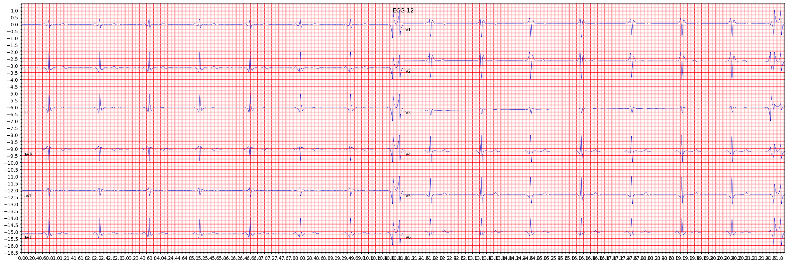

# Philips ECG Parser

Parses a Philips XML file by writing the output to a CSV file and saving the ECG waveform as a PNG.

Based on the [Sierra ECG Tools](https://github.com/sixlettervariables/sierra-ecg-tools) by Christopher Watford.

## Installation

Note that both a `requirements.txt` and conda `environment.yml` file to allow dependencies to be installed on a M1-based Mac.

```
conda create -n ecg python=3.8
conda activate ecg
conda env update --file environment.yml
pip install -r requirements.txt
```

## Single XML File

### Usage

```
python3 parse_xml.py <ECG XML file> <output CSV> <output 12-lead ECG waveform>
```

### Example

Command:
```
python3 parse_xml.py ecg-example.xml output.csv output.png
```

`output.csv`
```
date,time,dateofbirth,sex,mrn,csn,meanqrsdur,meanprint,heartrate,rrint,pdur,qonset,tonset,qtint,qtcb,qtcf,QTcFM,QTcH,pfrontaxis,i40frontaxis,qrsfrontaxis,stfrontaxis,tfrontaxis,phorizaxis,i40horizaxis,t40horizaxis,qrshorizaxis,sthorizaxis,severity,statements
2008-12-23,19:44:46,1976-01-01,Female,---,---,102,144,41,1463,508,512,,564,466,497,,,19,75,85,72,53,48,-8,-46,-43,122,OTHERWISE NORMAL ECG,"SINUS BRADYCARDIA,NO PREVIOUS TRACING AVAILABLE FOR COMPARISON"
```

`output.png`


## Folder of XML Files

### Usage

```
python3 parse_xml_folder.py <input ECG XML folder> <output CSV> <output 12-lead ECG waveforms>
```

### Example

Command:
```
python3 parse_xml_folder.py ecgs output.csv output.npy
```

`output.csv`
```
date,time,dateofbirth,sex,mrn,csn,meanqrsdur,meanprint,heartrate,rrint,pdur,qonset,tonset,qtint,qtcb,qtcf,QTcFM,QTcH,pfrontaxis,i40frontaxis,qrsfrontaxis,stfrontaxis,tfrontaxis,phorizaxis,i40horizaxis,t40horizaxis,qrshorizaxis,sthorizaxis,severity,statements
2008-12-23,19:44:46,1976-01-01,Female,---,---,102,144,41,1463,508,512,,564,466,497,,,19,75,85,72,53,48,-8,-46,-43,122,OTHERWISE NORMAL ECG,"SINUS BRADYCARDIA,NO PREVIOUS TRACING AVAILABLE FOR COMPARISON"
```

`output.npy`
A NumPy object of shape [n, 12, d], where n is the number of XML files (in same order as `output.csv`) and d is the length of the ECG recording.
